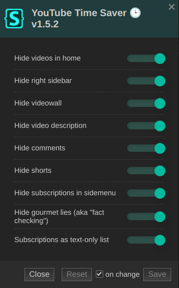

# YouTube Time Saver 🕒
Small CSS set to save you A LOT of time on YouTube 📺

## Requirements
Stylus extension for [Firefox](https://addons.mozilla.org/firefox/addon/styl-us/), [Chrome](https://chrome.google.com/webstore/detail/stylus/clngdbkpkpeebahjckkjfobafhncgmne) or [Opera](https://addons.opera.com/extensions/details/stylus/).

## Install

## Screenshot

